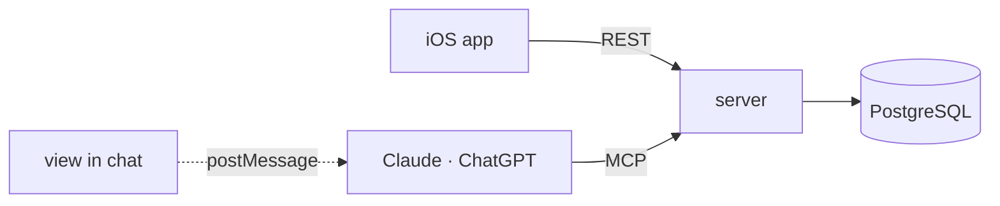

# IoT Switch

Control simulated IoT devices from a native iOS app **or** from an AI
assistant — the same account, the same devices, one set of rules.

Each device has exactly two persisted states, On and Off. That deliberate
smallness is the point: it leaves room to get the hard parts right — optimistic
concurrency, OAuth for third-party hosts, interactive UI inside a chat, and
the awkward case where a write succeeds but its response is lost.



---

## What is here

| | |
| --- | --- |
| [`server/`](./server) | Node + TypeScript. REST API, OAuth 2.1 authorization server, MCP server, four MCP App views |
| [`ios/`](./ios) | SwiftUI app for iPhone and iPad |
| [`spike/`](./spike) | The phase 0 feasibility spike, superseded and kept as a record |
| [`requirement.md`](./requirement.md) | The specification everything implements |
| [`docs/`](./docs) | Architecture, code flow, sequence diagrams, testing |

Roughly 12,700 lines, 202 tests.

---

## Quick start

**Requirements:** Node 22+ (25 recommended — it runs TypeScript directly).
Xcode 16+ only if you want the iOS app.

```bash
cd server
npm install
npm start            # http://localhost:4000
npm test             # 155 tests
```

Nothing to provision. The store is [PGlite](https://pglite.dev) — real
PostgreSQL compiled to WebAssembly — so there is no database to install.

<details>
<summary><b>Try it from the command line</b></summary>

```bash
# create an account
curl -s -X POST localhost:4000/v1/auth/signup \
  -H 'content-type: application/json' \
  -d '{"username":"sam","password":"correct horse battery staple"}'

# add a device, then switch it on
TOKEN=...
curl -s -X POST localhost:4000/v1/devices \
  -H "authorization: Bearer $TOKEN" -H 'content-type: application/json' \
  -d '{"name":"Bedroom Lamp"}'

curl -s -X PUT localhost:4000/v1/devices/DEVICE_ID/state \
  -H "authorization: Bearer $TOKEN" -H 'content-type: application/json' \
  -d '{"state":"on","expectedVersion":1}'
```
</details>

<details>
<summary><b>Run the iOS app</b></summary>

```bash
cd ios
open IoTSwitch.xcodeproj
```

It points at `http://localhost:4000` by default. Pass
`-apiBaseURL http://…` as a launch argument to aim it elsewhere.

```bash
xcodebuild -project IoTSwitch.xcodeproj -scheme IoTSwitch \
  -destination 'platform=iOS Simulator,name=iPhone 17 Pro' test
```
</details>

<details>
<summary><b>Connect an AI host</b></summary>

```bash
cd server && npm run host-check
```

Opens a tunnel, starts the server told the origin it is reachable at, verifies
the whole discovery chain over real HTTPS, and prints a connector URL.

Add that URL in Claude or ChatGPT under **Settings → Connectors**. Do it on
web or desktop — a custom connector must be added there before it appears on
mobile. Then ask for your devices.
</details>

<details>
<summary><b>Look at the views without a host</b></summary>

```bash
npm start
node tools/mock-host/run.mjs      # prints a URL
```

A mock MCP Apps host that renders any view with a live message log. It exists
because the views cannot otherwise be looked at — and it has found bugs no
unit test did.
</details>

---

## How it works

```
POST /v1/devices/…/state  ─┐
                           ├─→  domain/devices.ts  ─→  PostgreSQL
MCP tools/call             ─┘    validation · ownership · versions · audit
```

Both front doors call the **same** functions, which take an `Identity` rather
than an HTTP request. Neither adapter validates a name, checks ownership or
compares a version — so the two surfaces cannot drift apart. That is §3 of the
specification, enforced structurally rather than by discipline.

Three ideas do most of the work:

**Every write carries the version it saw.** The check and the write are one
SQL statement, so two callers holding the same version cannot both succeed.
There is no `toggle` — a retry can never invert what it is retrying.

**An unknown outcome is its own case.** A mutation that fails in transit may
or may not have applied. The client reads before offering a retry, and never
sends the inverse command. That is how a switch ends up flipping itself back.

**Credentials are typed in exactly one place.** A hosted authorization page,
reached through the host's OAuth flow. Never in a conversation, a tool
argument, or a view.

**→ [Architecture](./docs/architecture.md)** ·
**[Code flow](./docs/code-flow.md)** ·
**[Sequence diagrams](./docs/sequence-diagrams.md)** ·
**[Testing](./docs/testing.md)**

---

## The API

Four device operations, and an authentication service that is separate from
them.

| | |
| --- | --- |
| `GET /v1/devices` | Every owned device, oldest first |
| `GET /v1/devices/{id}` | One owned device |
| `PUT /v1/devices/{id}/state` | `{ state, expectedVersion }` |
| `POST /v1/devices` | `{ name }`, optional `Idempotency-Key` |

Plus `/v1/auth/{signup,login,me,refresh,logout}`, the OAuth endpoints, and
`/mcp`.

### MCP tools

| Tool | Scope | View |
| --- | --- | --- |
| `list_devices` | `devices:read` | `ui://iot/devices.html` |
| `get_device` | `devices:read` | `ui://iot/device.html` |
| `control_device` | `devices:control` | — |
| `add_device` | `devices:create` | — |
| `get_auth_status` | public | — |
| `show_auth` | public | `ui://iot/auth.html` |
| `show_add_device` | public | `ui://iot/add-device.html` |

---

## Configuration

| Variable | Default | |
| --- | --- | --- |
| `PORT` | `4000` | |
| `BASE_URL` | `http://localhost:$PORT` | **Must match the registered connector URL exactly.** Becomes the OAuth issuer, the RFC 8707 resource indicator and the token audience |
| `DATABASE_PATH` | `./.data` | Delete it to reset |
| `ACCESS_TOKEN_TTL_SECONDS` | `900` | |
| `REFRESH_TOKEN_TTL_SECONDS` | `2592000` | |
| `AUTH_RATE_LIMIT_PER_MINUTE` | `20` | Credential submissions per address |
| `TRUST_PROXY` | off | Only behind a proxy you control |

---

## Status

202 tests pass. `npm run acceptance` reports **20 of 28** acceptance criteria
proven, 5 partial, 3 open.

The remaining eight need a host account or a physical device — whether a host
renders the views, how many rows survive an inline card, whether every write
is confirmed, iPad. The report names each gap rather than letting a green
suite imply otherwise. They close in
[`spike/FINDINGS.md`](./spike/FINDINGS.md).

Known limits are listed in
[Architecture §10](./docs/architecture.md#10-known-limits). The two worth
knowing before you rely on anything: **storage is PGlite**, so concurrency is
proven logically rather than under real row-level contention, and **there is
no deployment** — everything has run on localhost or a tunnel.

---

## Contributing

See [CONTRIBUTING.md](./CONTRIBUTING.md).

## Licence

[MIT](./LICENSE).
