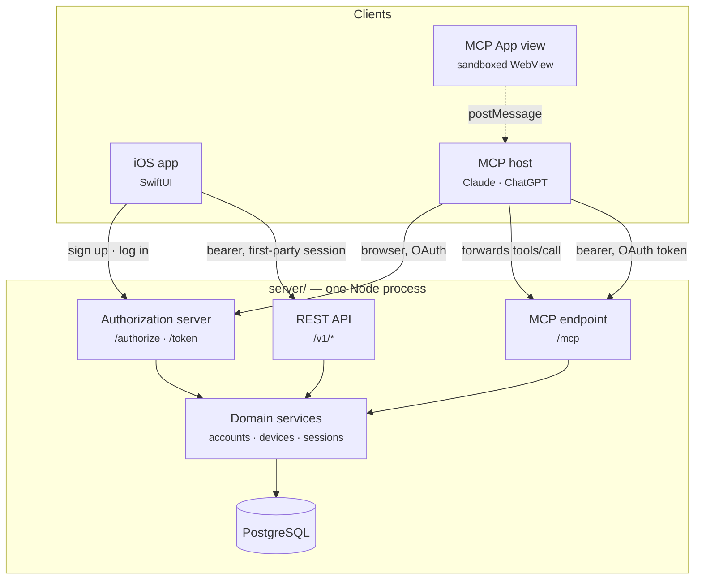
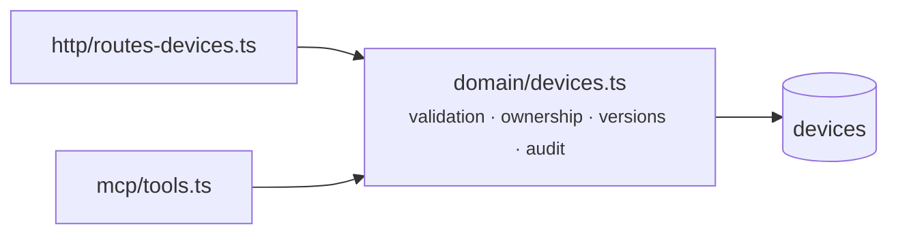
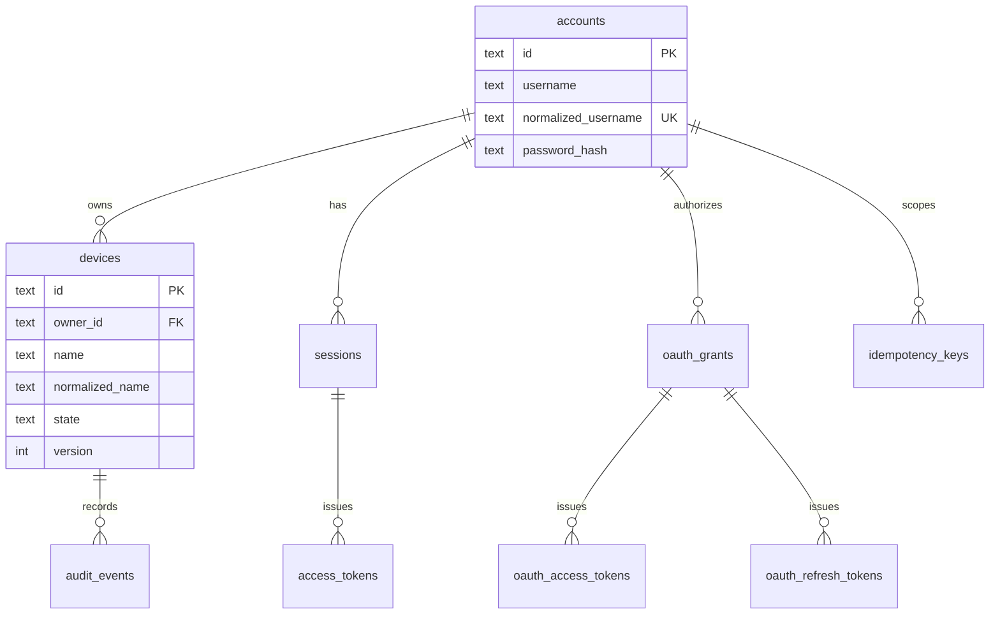
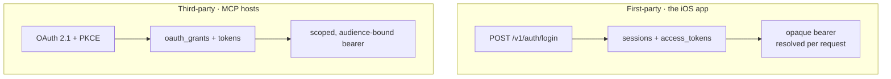
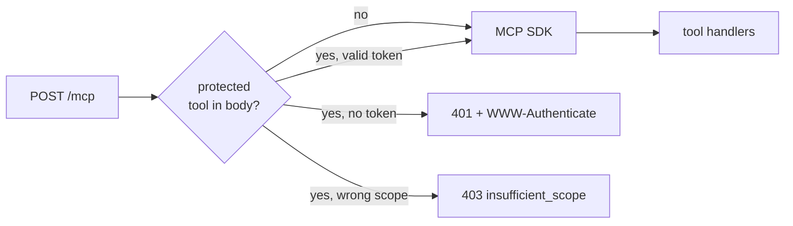
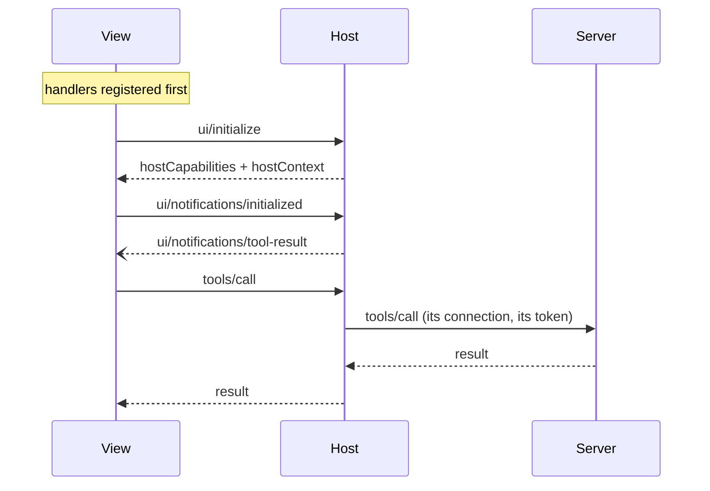
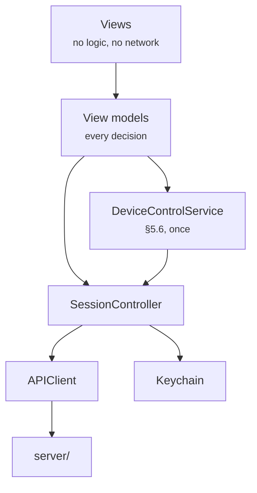

# Architecture

IoT Switch is one product with two front doors. A native iOS app and any
MCP-compatible AI host both reach the same devices, the same accounts and the
same business rules. This document explains how that is arranged and, where it
matters, why it is arranged that way.

The requirements it implements are in [`requirement.md`](../requirement.md).
Section references throughout point there.

---

## 1. The shape of it



The dotted line is the one people get wrong. **A view never talks to the
server.** It speaks `postMessage` to its host, and the host decides whether to
forward a `tools/call` over its own authenticated connection. A view holds no
token and has no network reach of its own.

---

## 2. The rule everything else follows

> The device API and MCP tools must use the same business rules and database.
> They must not maintain separate copies of a user's devices. — §3

This is enforced structurally rather than by discipline. `domain/devices.ts`
exports four functions that take an `Identity` — not an HTTP request, not a
tool call:

```ts
listDevices(db, identity)
getDevice(db, identity, deviceId)
addDevice(db, identity, { name, idempotencyKey })
controlDevice(db, identity, { deviceId, state, expectedVersion })
```



Both adapters do the same three things: verify a credential, turn it into an
`Identity`, and translate the result. Neither validates a name, checks
ownership or compares a version — those live in one place, so they cannot
drift apart.

`Identity` carries the channel:

```ts
interface Identity {
  accountId: string;
  channel: 'native' | 'mcp' | 'internal';
  requestId?: string;
}
```

Every mutation is audited with it, which is what makes "who changed this, and
from where" answerable after the fact.

---

## 3. Layout

```
server/
  src/
    config.ts           BASE_URL and the values everything derives from
    normalize.ts        the name folds — one implementation, imported everywhere
    password.ts         Argon2id
    errors.ts           the closed error-code set (§6.3)
    db/                 driver seam, schema, migrations
    domain/             accounts · sessions · devices · audit
    http/               REST adapter: routes, middleware, one error mapping
    oauth/              OAuth 2.1 authorization server
    mcp/                MCP adapter: gate, tools, resources
      ui/assets/        the four views, plus the shared bridge and stylesheet
  test/                 155 tests
  acceptance/           criteria mapped to the tests that establish them
  tools/                dev harnesses: mock-host, host-check, client-check

ios/
  IoTSwitch/            SwiftUI app — models, networking, session, view models, views
  IoTSwitchTests/       47 tests

spike/                  phase 0 feasibility spike, superseded and kept as a record
```

---

## 4. Data model



Twelve tables in three groups: the domain (`accounts`, `devices`,
`audit_events`), first-party sessions (`sessions`, `access_tokens`,
`idempotency_keys`), and OAuth (`oauth_clients`,
`oauth_pending_authorizations`, `oauth_authorization_codes`, `oauth_grants`,
`oauth_access_tokens`, `oauth_refresh_tokens`).

### Two constraints carry the acceptance criteria

Application code loses races. The database does not.

```sql
CONSTRAINT devices_owner_name_key UNIQUE (owner_id, normalized_name)
```

is what actually prevents a duplicate device (AC-09). Creation uses
`ON CONFLICT DO NOTHING` rather than catching a unique violation, because on
PostgreSQL a failed statement aborts the transaction and leaves nothing usable
to continue with.

```sql
UPDATE devices
   SET state = $1, version = version + 1, updated_at = now()
 WHERE id = $2 AND owner_id = $3 AND version = $4 AND state <> $1
```

makes the version check and the write one statement, so two callers holding
the same version cannot both succeed (AC-10). `state <> $1` excludes the
no-op, which must not consume a version.

### Normalization

One module, imported by every caller. If this logic forks, two devices whose
names differ only by case both get created and AC-09 fails in a way that is
unpleasant to trace.

| | Fold |
| --- | --- |
| Username | trim → NFKC → lowercase; charset restricted to ASCII so the fold is deterministic |
| Device name | trim → collapse internal whitespace → NFKC → lowercase |

`toLowerCase` is not full Unicode case folding, and device names are not
charset-restricted, so `Straße` and `STRASSE` remain distinct. Documented
rather than overclaimed.

---

## 5. Authentication: two systems, deliberately separate



They never mix. A first-party token is not accepted at `/mcp`; an OAuth token
is not accepted at `/v1/*`. §7.2 requires that logging out of one does not
silently claim to disconnect the other.

### Why tokens are opaque and resolved per request

§7.2 requires that logout invalidates access tokens **already issued**. A
signed token validated only by signature and expiry cannot be withdrawn. So
every protected request joins the token to its session:

```sql
SELECT t.account_id, t.session_id
  FROM access_tokens t
  JOIN sessions s ON s.id = t.session_id
 WHERE t.token_hash = $1
   AND t.expires_at > now()
   AND s.revoked_at IS NULL
```

That lookup is on the hot path by design, not by accident.

### Refresh rotation and reuse detection

Each refresh appends a row to the same family and marks the old one replaced.
Presenting an already-replaced token means it leaked, so the **whole family**
is revoked — including the token the thief did not steal.

Rotation marks the outgoing session replaced but does **not** revoke it. Its
refresh token is already dead and its access token expires within minutes;
revoking immediately would fail every request a client had in flight when it
refreshed proactively.

### Scopes

`devices:read`, `devices:control`, `devices:create` — all three requested at
initial authorization and named in the `401` challenge. Minimising to
`devices:read` would make the first switch flip trigger a `403
insufficient_scope` and a re-consent prompt mid-interaction, which is a poor
experience for a light switch and slow to correct: hosts cache discovery
documents globally for minutes.

---

## 6. The MCP adapter

### The gate runs before the SDK



A refusal has to be an HTTP status. Once a tool handler is running its return
value is already destined for a `200`, and a `200` carrying `isError` is an
application failure — the host passes the text to the model and moves on, and
no authentication prompt appears. So the gate inspects the parsed JSON-RPC
body in the Express handler, before `transport.handleRequest`.

**It collects every protected call in the body, not the first.** A JSON-RPC
body may be a batch and the SDK executes all of it; authorizing only the first
let a `devices:read` token send `[list_devices, control_device]` and change a
device. That was a working privilege escalation, found in review.

### Transport errors versus tool errors

| Failure | How it surfaces | Why |
| --- | --- | --- |
| No token, wrong scope | HTTP `401` / `403` with a challenge | Only this makes a host authorize |
| Version conflict, name clash, not found | `200`, `isError: true` | A normal outcome the model should act on |

Error results carry **no** `structuredContent`. A client validates it against
the tool's declared `outputSchema` whenever present, including on errors — so
an error shaped `{error:{…}}` against a schema describing `{device}` reached
the caller as a protocol error instead of the conflict. Codes travel in
`_meta['iot/error']`, which is not schema-bound.

### Tool catalogue

| Tool | Scope | View |
| --- | --- | --- |
| `list_devices` | `devices:read` | `ui://iot/devices.html` |
| `get_device` | `devices:read` | `ui://iot/device.html` |
| `control_device` | `devices:control` | — |
| `add_device` | `devices:create` | — |
| `get_auth_status` | public | — |
| `show_auth` | public | `ui://iot/auth.html` |
| `show_add_device` | public | `ui://iot/add-device.html` |

Both presentation tools are public. Gating a form's *display* behind a write
scope means merely showing it can trigger a `403` and a re-consent prompt
before the person has typed anything.

`control_device` and `add_device` are `idempotentHint: false`. Replaying
either fails rather than repeating, and a host may retry on that hint.

---

## 7. The views

Four `ui://` resources, each assembled at startup from a shared stylesheet, a
shared bridge and one view script — all inlined, which is what lets
`_meta.ui.csp` stay empty. A host blocks every external origin by default; a
page needing none cannot be broken by that policy and cannot widen it.



Constraints that shaped the design:

- **Handlers are registered before the handshake.** A host may push
  `tool-input` or `tool-result` the instant it completes.
- **The sender is identified by window reference**, not origin — origin is
  unpredictable inside a sandbox.
- **A size is reported only when it changed.** A host that resizes in response
  would otherwise drive an unbounded loop.
- **Safe areas come from `hostContext`**, not CSS `env()`. Inside a chat
  WebView the page is not the thing the notch overlaps, and a control outside
  the insets cannot be tapped.
- **Handlers are additive.** A registry keyed by method let a view listening
  for `host-context-changed` silently replace the bridge's own handling, so
  the bridge never learned the display mode had changed.

### The inline row budget

`devices.js` renders `INLINE_ROW_BUDGET` rows inline and offers fullscreen for
the rest, because on a phone the conversation owns vertical scrolling: a pan
starting inside an inline card scrolls the chat, and the host clips overflow.
A long list rendered inline is partly **unreachable**, not merely ugly.

The number is **4**, which is published guidance and not a measurement. It is
commented `NOT MEASURED`. Question 2 in
[`spike/FINDINGS.md`](../spike/FINDINGS.md) exists to replace it.

---

## 8. The iOS app



**Views hold no logic and make no network calls.** Every decision lives in a
view model, which is what lets the switch behaviour be tested exhaustively
without driving a simulator.

`DeviceControlService` implements §5.6 once and both the list and detail
screens use it — §5.4 requires them to behave identically, and two copies of a
state machine do not stay identical.

Three outcomes carry the weight:

- **Version conflict** — refetch, then say what the device actually *is*.
- **Unknown outcome** — a mutation that failed in transit may or may not have
  applied. `APIError.unknownOutcome` exists so this cannot be mistaken for an
  ordinary failure: the client reads before offering a retry and **never**
  sends the inverse command. That is how a switch ends up flipping itself back.
- **Pending intent is not state** — an unconfirmed change never becomes the
  displayed truth.

Refresh is single-flight. The backend revokes an entire token family on a
replayed refresh token, so two requests racing to refresh would not merely
duplicate work — they would log the user out of every device.

---

## 9. Storage

The store is [PGlite](https://pglite.dev): real PostgreSQL compiled to
WebAssembly. Same SQL, same constraint enforcement, same SQLSTATEs — the
schema and every query run unmodified on a PostgreSQL server.

What it is not is a server. It runs in-process and serialises queries, so no
two statements are ever truly concurrent. **The concurrency tests prove the
logic is correct when two callers start from the same observed state; they do
not prove behaviour under genuine row-level contention.**

Everything above `src/db` is written against a `Queryable` interface and plain
PostgreSQL SQL precisely so that closing that gap is one file.

---

## 10. Known limits

| | |
| --- | --- |
| No `pg` driver | Concurrency proven logically, not under contention |
| Inline row budget | Published guidance, not measured |
| Rate limiter | Per-process and in-memory |
| Case folding | `toLowerCase`, not full Unicode folding |
| DCR eviction | Runs on registration, not on a timer |
| iPad | Renders, but as the iPhone layout scaled up |
| iOS signing | Ad-hoc; a distribution build needs a real team |
| No deployment | Everything has run on localhost or a tunnel |

Eight acceptance criteria cannot be closed without a host account or a
physical device. `npm run acceptance` names each one.
