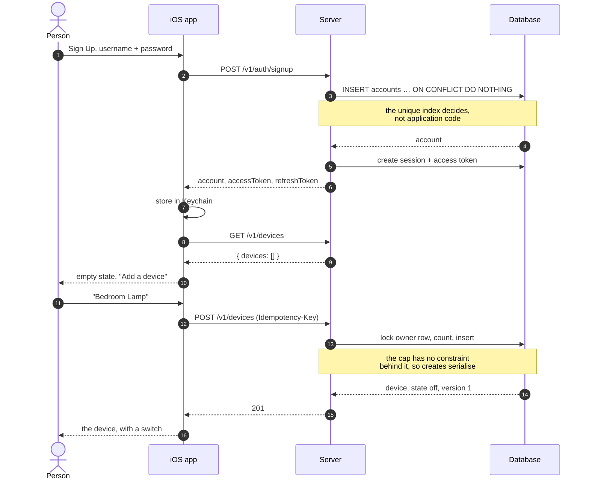
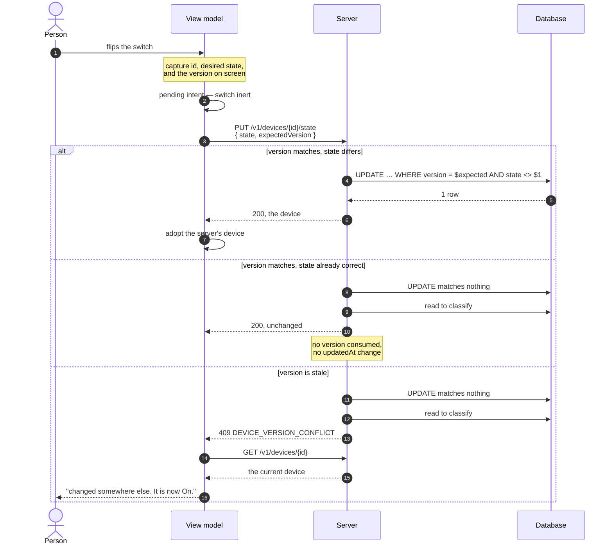
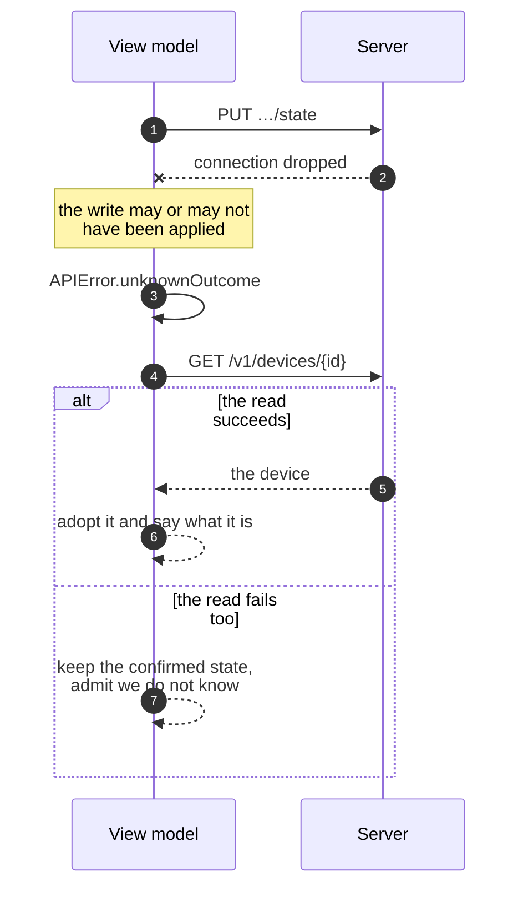
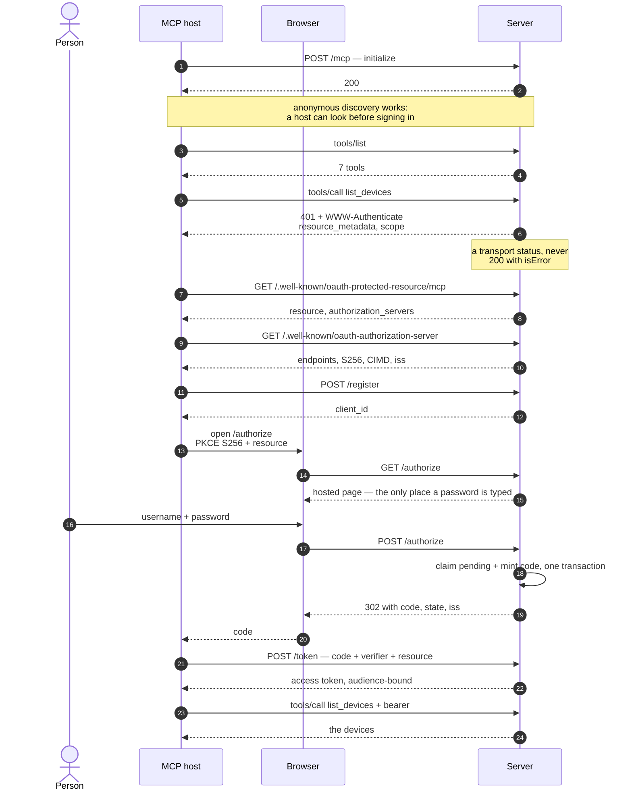
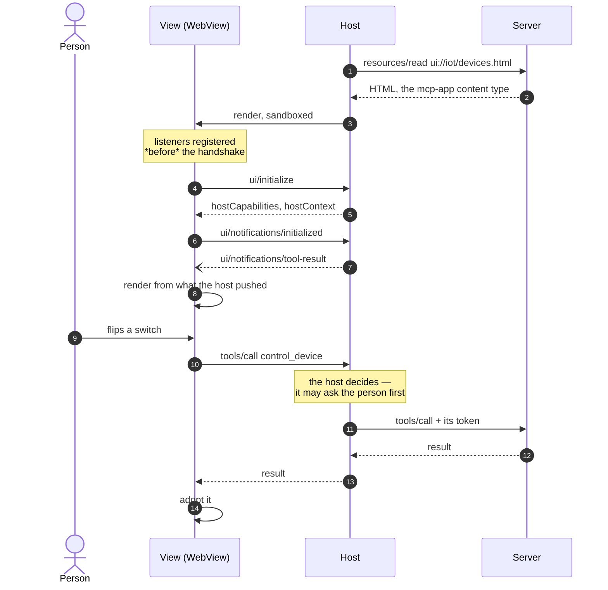
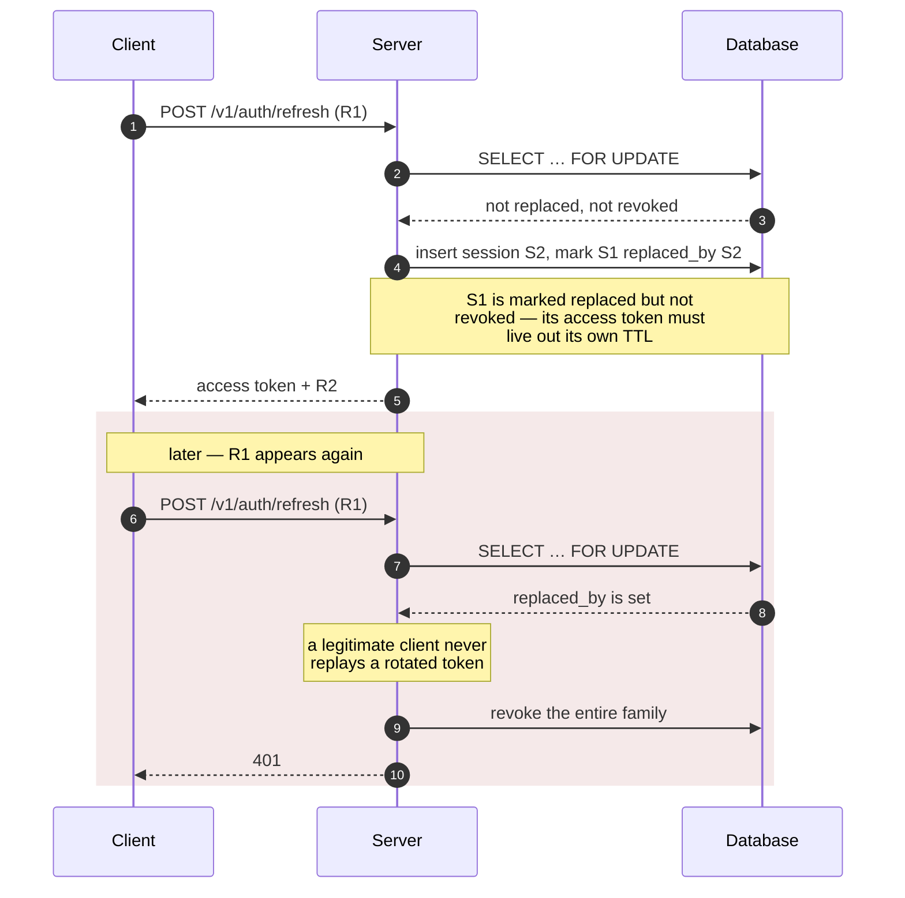
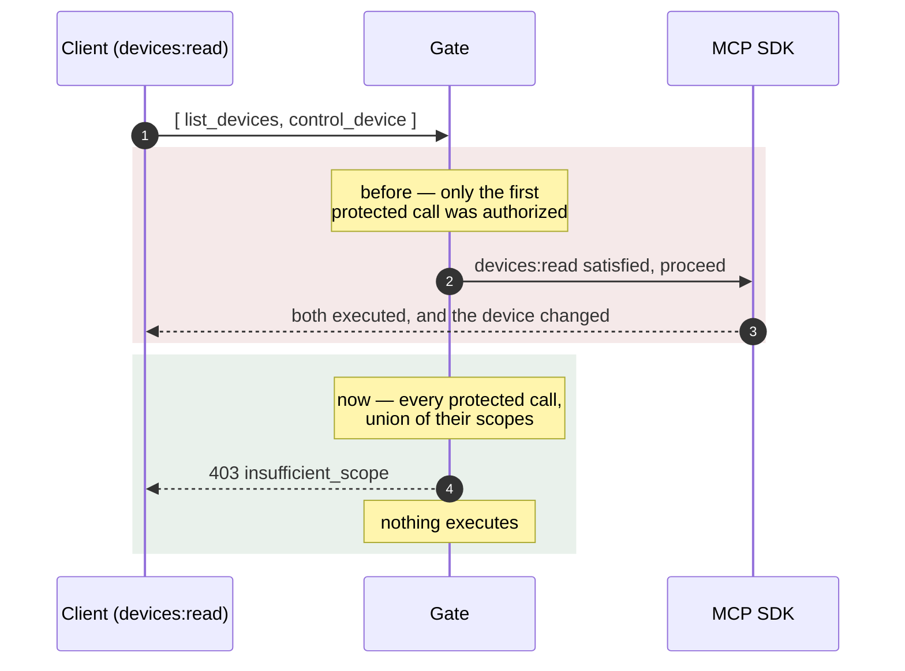
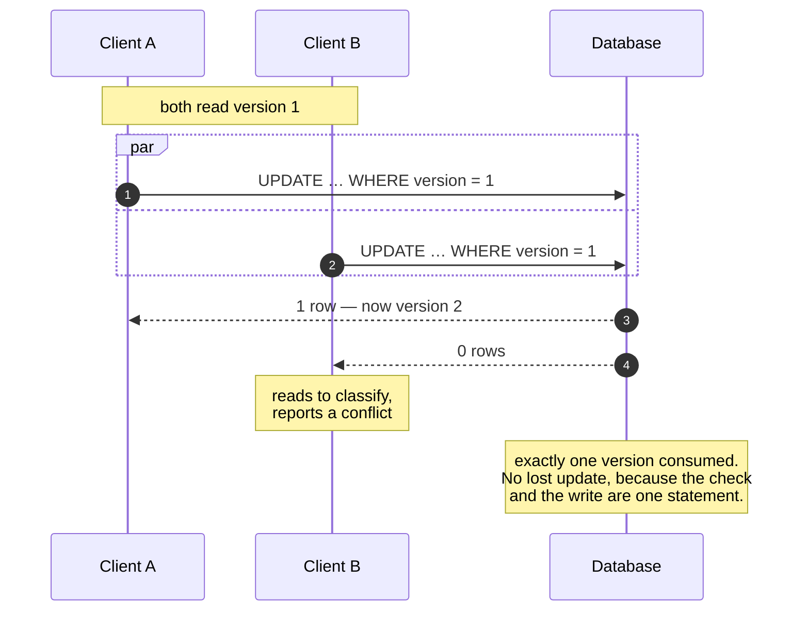

# Sequence diagrams

The flows that matter, in the order you are likely to need them. Each one is
what the code actually does — where a diagram simplifies, it says so.

Companion documents: [Architecture](./architecture.md) ·
[Code flow](./code-flow.md)

---

## 1. Native app — sign up and add the first device

Implements §10.1.

---

## 2. Controlling a switch, and losing a race

Implements §5.6 and §6.1. This is the most carefully specified flow in the
product.

### The unknown outcome

The case everything else is arranged around: a write whose response was lost.

**Never** infer success, and **never** send the inverse command. That is how a
switch ends up flipping itself back.

---

## 3. An MCP host connecting for the first time

Implements §10.3 and AC-24. The host does the work; nothing is hard-coded in
it.

---

## 4. A view, its host, and the server

Implements §9.2. The triangle people get wrong.

The view never reaches the server. It holds no token and has no network of its
own; the host owns the connection.

---

## 5. Refresh rotation, and a stolen token

Implements §7.1 and §7.2.

The revocation happens **outside** the transaction that carries the refusal.
Performing it inside meant the rollback undid it, and a detected theft revoked
nothing.

---

## 6. A batch that tries to smuggle a write

The privilege escalation found in review, and what stops it now.

---

## 7. Two writers, one version

AC-10, and why the check lives in SQL.

